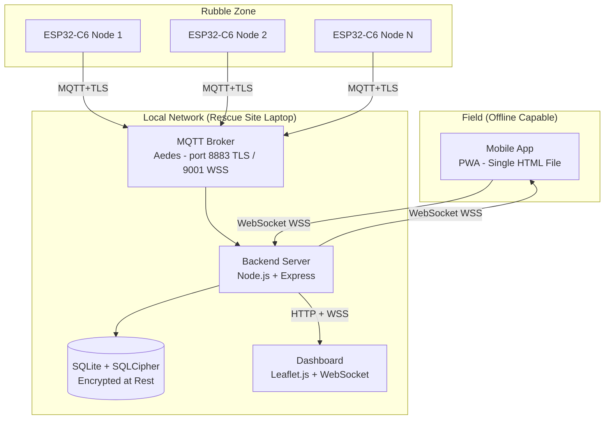
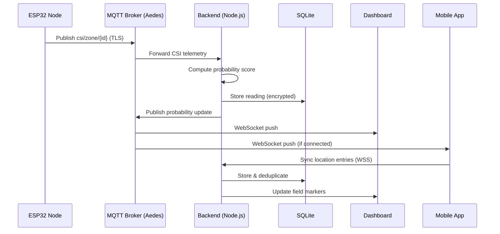
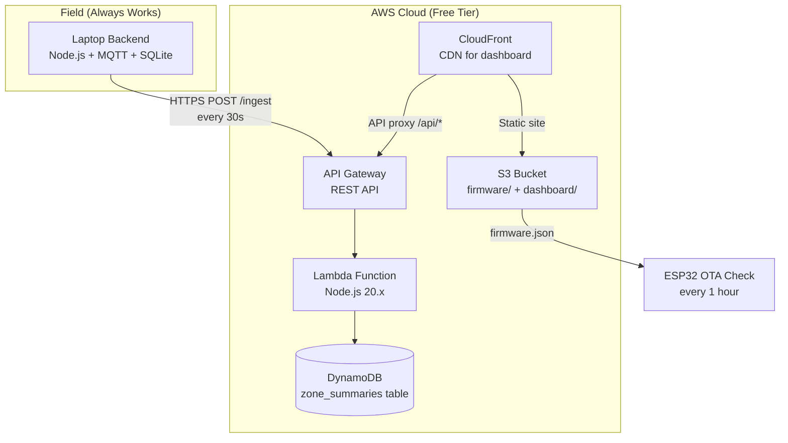

# Design Document: CALI Rescue System

## Overview

The CALI Rescue System is a multi-component field tool for search and rescue operations following the Cali disaster. It integrates acoustic knock detection, Wi-Fi Channel State Information (CSI) motion sensing via ESP32-C6 nodes, GPS location logging, and a unified probability scoring engine into a secure, local-network architecture.

The system comprises three deliverables:

1. **Enhanced Mobile PWA** — A single-file HTML progressive web app with offline-first acoustic detection, GPS logging, map view, WebSocket connectivity to backend, and data sync.
2. **Secure Local Backend** — A Node.js server running on a laptop at the rescue site with an Aedes MQTT broker, Express HTTP server, SQLite database, real-time dashboard, and probability scoring engine.
3. **ESP32 CSI Firmware** — ESP-IDF firmware based on the official `espressif/esp-csi` framework for ESP32-C6 Super Mini nodes, implementing motion detection via subcarrier amplitude variance analysis.

### Security Posture

Given the Venezuela precedent where a similar rescue app was compromised and 200,000 people's PII was stolen, this system adopts a **local-first, zero-trust** architecture:

- No cloud services or internet-facing endpoints in the base deployment
- All transport encrypted (TLS/WSS for MQTT and WebSocket)
- Token-based device authentication
- Encrypted database at rest (SQLCipher)
- Minimal PII collection with automatic data lifecycle management
- GPS coordinates treated as sensitive PII — encrypted in transit and at rest

## Architecture

### System Topology



### Communication Protocols

| Path | Protocol | Port | Security |
|------|----------|------|----------|
| ESP32 → MQTT Broker | MQTT over TLS | 8883 | Pre-shared token + TLS |
| Mobile App → Backend | WebSocket Secure | 9001 | JWT token + WSS |
| Browser → Dashboard | HTTPS + WSS | 3000 | Same-network, token auth |
| Backend → Database | Local file I/O | N/A | SQLCipher encryption key |

### Deployment Model

The backend stack runs on a laptop at the rescue site. No internet connectivity is required for field operation. The ESP32 nodes connect to a dedicated Wi-Fi access point (the laptop's hotspot or a field router). Mobile apps connect to the same local network when in range, and operate fully offline otherwise.

**Hybrid cloud extension (optional):** When the laptop has internet access, a bridge service aggregates zone state every 30 seconds and uploads summaries to AWS (API Gateway → Lambda → DynamoDB). A remote dashboard on CloudFront provides visibility to coordinators outside the field. ESP32 nodes can also check S3 for OTA firmware updates every hour. If internet is unavailable, the cloud layer is simply skipped — zero impact on field operations.



## Components and Interfaces

### 1. Mobile App (Enhanced PWA)

**Responsibilities:**
- Acoustic detection with bandpass filtering and spectral centroid analysis
- GPS location logging with note capture
- Offline data persistence via localStorage
- Map view of logged locations (Leaflet.js)
- WebSocket connectivity to backend for alerts and data sync
- PWA install support (service worker, manifest)

**Key Interfaces:**

```typescript
// Acoustic Detection Engine
interface AcousticDetector {
  start(): Promise<void>;
  stop(): void;
  onKnockPattern(callback: (event: KnockPatternEvent) => void): void;
  getRmsLevel(): number;
  getNoiseFloor(): number;
}

interface KnockPatternEvent {
  timestamp: number;        // Unix ms
  peakCount: number;        // Number of peaks in pattern
  meanInterval: number;     // Mean ms between peaks
  intervalStdDev: number;   // Standard deviation of intervals
  confidence: number;       // 0.0-1.0
}

// Location Management
interface LocationEntry {
  id: string;               // UUID v4
  timestamp: string;        // ISO 8601
  lat: number;
  lon: number;
  accuracy: number;         // meters
  note: string;
  synced: boolean;          // true if backend acknowledged
}

// Backend Connection
interface BackendConnection {
  connect(url: string, token: string): Promise<void>;
  disconnect(): void;
  subscribe(topic: string): void;
  onMessage(callback: (topic: string, payload: object) => void): void;
  syncLocations(entries: LocationEntry[]): Promise<SyncResult>;
  isConnected(): boolean;
}

interface SyncResult {
  acknowledged: string[];   // IDs confirmed by backend
  failed: string[];         // IDs that failed
}
```

### 2. Backend Server

**Responsibilities:**
- Host Aedes MQTT broker with TLS
- Validate and relay ESP32 CSI telemetry
- Compute unified probability scores per zone
- Serve real-time dashboard
- Accept and store mobile app location syncs
- Manage device authentication tokens

**Key Interfaces:**

```typescript
// MQTT Message Schemas
interface CsiTelemetryMessage {
  zone_id: string;          // 1-64 chars
  timestamp: string;        // ISO 8601
  motion_probability: number; // 0.0-1.0
  node_id: string;          // 1-64 chars
}

interface ProbabilityUpdate {
  zone_id: string;
  probability: number;      // 0-100 integer
  sources: {
    csi: number | null;     // contribution or null if stale
    acoustic: number | null;
    gps: number | null;
  };
  timestamp: string;        // ISO 8601
}

interface PriorityAlert {
  zone_id: string;
  probability: number;
  triggered_at: string;     // ISO 8601
  contributing_factors: string[];
}

// Location Sync Protocol
interface LocationSyncBatch {
  entries: LocationEntry[];  // max 50 per batch
  device_token: string;
}

interface LocationSyncAck {
  acknowledged_ids: string[];
  errors: { id: string; reason: string }[];
}

// Zone Management
interface Zone {
  id: string;
  name: string;
  center_lat: number;
  center_lon: number;
  radius_m: number;         // default 50m
  nodes: string[];          // node_ids assigned
  last_probability: number;
  last_update: string;      // ISO 8601
}
```

### 3. ESP32 CSI Firmware

**Responsibilities:**
- Transmit Wi-Fi CSI ping frames at 20 fps
- Measure subcarrier amplitude variance over sliding window (40 samples / 2s)
- Compute motion_probability (0.0–1.0)
- Publish to MQTT broker every 2 seconds
- Buffer readings when disconnected (up to 60 readings)
- Manage power (light-sleep between cycles, <80mA average)
- Read configuration from NVS

**Key Interfaces:**

```c
// CSI Processing Pipeline
typedef struct {
    float subcarrier_amplitudes[64];  // CSI subcarrier data
    int64_t timestamp_ms;
} csi_frame_t;

typedef struct {
    float motion_probability;  // 0.0 - 1.0
    int64_t timestamp_ms;      // capture time
    char zone_id[65];
    char node_id[65];
} motion_reading_t;

// Configuration (NVS)
typedef struct {
    char zone_id[65];
    char mqtt_broker_host[128];
    uint16_t mqtt_broker_port;      // default 8883
    char mqtt_token[128];           // pre-shared auth token
    uint8_t csi_tx_rate;            // frames per second (default 20)
    uint16_t window_size;           // sliding window samples (default 40)
} node_config_t;

// Buffer Management
#define BUFFER_MAX_READINGS 60
typedef struct {
    motion_reading_t readings[BUFFER_MAX_READINGS];
    uint16_t count;
    uint16_t head;
} reading_buffer_t;
```

### 4. Dashboard

**Responsibilities:**
- Display zone markers on Leaflet.js map with color-coded probability
- Show ESP32 node connection status (online/offline)
- Display field report markers from synced mobile app locations
- Real-time updates via WebSocket subscription

**Key Interfaces:**

```typescript
// Dashboard State
interface DashboardState {
  zones: Map<string, ZoneDisplay>;
  nodes: Map<string, NodeStatus>;
  fieldReports: LocationEntry[];
}

interface ZoneDisplay {
  zone_id: string;
  probability: number;
  color: 'green' | 'yellow' | 'red' | 'grey';
  last_update: string;
  marker: L.Marker;
}

interface NodeStatus {
  node_id: string;
  zone_id: string;
  online: boolean;
  last_seen: string;        // ISO 8601
}
```

## Data Models

### SQLite Schema (Backend — SQLCipher Encrypted)

```sql
-- Zone definitions
CREATE TABLE zones (
    id TEXT PRIMARY KEY,
    name TEXT NOT NULL,
    center_lat REAL NOT NULL,
    center_lon REAL NOT NULL,
    radius_m REAL NOT NULL DEFAULT 50,
    created_at TEXT NOT NULL DEFAULT (datetime('now'))
);

-- CSI readings from ESP32 nodes
CREATE TABLE csi_readings (
    id INTEGER PRIMARY KEY AUTOINCREMENT,
    zone_id TEXT NOT NULL REFERENCES zones(id),
    node_id TEXT NOT NULL,
    motion_probability REAL NOT NULL CHECK(motion_probability >= 0.0 AND motion_probability <= 1.0),
    captured_at TEXT NOT NULL,  -- original timestamp from ESP32
    received_at TEXT NOT NULL DEFAULT (datetime('now')),
    UNIQUE(node_id, captured_at)  -- prevent duplicate buffered readings
);

-- Acoustic detection reports from mobile apps
CREATE TABLE acoustic_reports (
    id TEXT PRIMARY KEY,
    zone_id TEXT NOT NULL REFERENCES zones(id),
    device_token TEXT NOT NULL,
    peak_count INTEGER NOT NULL,
    mean_interval_ms REAL NOT NULL,
    confidence REAL NOT NULL CHECK(confidence >= 0.0 AND confidence <= 1.0),
    lat REAL,
    lon REAL,
    reported_at TEXT NOT NULL,
    received_at TEXT NOT NULL DEFAULT (datetime('now'))
);

-- Synced location entries from mobile apps
CREATE TABLE location_entries (
    id TEXT PRIMARY KEY,       -- UUID from mobile app
    device_token TEXT NOT NULL,
    lat REAL NOT NULL,
    lon REAL NOT NULL,
    accuracy_m REAL NOT NULL,
    note TEXT,
    captured_at TEXT NOT NULL,
    received_at TEXT NOT NULL DEFAULT (datetime('now'))
);

-- Device authentication tokens
CREATE TABLE device_tokens (
    token TEXT PRIMARY KEY,
    device_type TEXT NOT NULL CHECK(device_type IN ('esp32', 'mobile')),
    label TEXT,               -- human-readable name
    zone_id TEXT REFERENCES zones(id),  -- for esp32 nodes
    created_at TEXT NOT NULL DEFAULT (datetime('now')),
    last_seen_at TEXT,
    revoked INTEGER NOT NULL DEFAULT 0
);

-- Computed probability scores (latest per zone)
CREATE TABLE probability_scores (
    zone_id TEXT PRIMARY KEY REFERENCES zones(id),
    score INTEGER NOT NULL CHECK(score >= 0 AND score <= 100),
    csi_contribution REAL,
    acoustic_contribution REAL,
    gps_contribution REAL,
    computed_at TEXT NOT NULL DEFAULT (datetime('now'))
);

-- Indexes for query performance
CREATE INDEX idx_csi_zone_time ON csi_readings(zone_id, received_at DESC);
CREATE INDEX idx_locations_device ON location_entries(device_token, captured_at DESC);
CREATE INDEX idx_acoustic_zone ON acoustic_reports(zone_id, received_at DESC);
```

### localStorage Schema (Mobile App)

```typescript
// Key: "cali_rescue_locations"
// Value: JSON string of LocationEntry[]
interface StoredLocations {
  version: 1;
  entries: LocationEntry[];
}

// Key: "cali_rescue_config"
interface StoredConfig {
  backend_url: string | null;
  device_token: string | null;
  last_sync_at: string | null;
}

// Key: "cali_rescue_alerts"
// Most recent 50 zone alerts
interface StoredAlerts {
  alerts: ZoneAlert[];
}

interface ZoneAlert {
  zone_id: string;
  motion_probability: number;
  timestamp: string;
}
```

### NVS Schema (ESP32)

| Key | Type | Description |
|-----|------|-------------|
| `zone_id` | string | Zone this node belongs to |
| `mqtt_host` | string | Broker IP/hostname |
| `mqtt_port` | u16 | Broker port (default 8883) |
| `mqtt_token` | string | Pre-shared authentication token |
| `node_id` | string | Unique node identifier |

## Correctness Properties

*A property is a characteristic or behavior that should hold true across all valid executions of a system — essentially, a formal statement about what the system should do. Properties serve as the bridge between human-readable specifications and machine-verifiable correctness guarantees.*

### Property 1: Knock pattern classification correctness

*For any* sequence of peak timestamps within a 6-second window, the knock detection algorithm SHALL classify the sequence as a Knock_Pattern if and only if: (a) the sequence contains 3 or more peaks, (b) the mean interval between consecutive peaks is between 200 ms and 2500 ms, and (c) the standard deviation of intervals is below 55% of the mean interval.

**Validates: Requirements 1.3**

### Property 2: Alert cooldown suppression

*For any* sequence of Knock_Pattern detection events with their timestamps, the alert system SHALL emit an alert for the first detection and suppress all subsequent alerts that occur within 4 seconds of the previous emitted alert.

**Validates: Requirements 1.4**

### Property 3: Noise floor tracking and peak classification

*For any* sequence of RMS samples, the noise floor SHALL equal the result of exponential smoothing with alpha = 0.005 initialized at 0.02, and a sample SHALL be classified as a peak if and only if its RMS exceeds the maximum of (3.5 × current noise floor, 0.06).

**Validates: Requirements 1.7**

### Property 4: Location share text format completeness

*For any* valid LocationEntry, the formatted share text SHALL contain all fields in this exact order: timestamp, accuracy in meters, note text, coordinates as "lat, lon", and a Google Maps link matching the pattern "https://maps.google.com/?q={lat},{lon}".

**Validates: Requirements 2.1, 2.4**

### Property 5: Location entry persistence round-trip

*For any* valid LocationEntry, serializing to localStorage and deserializing back SHALL produce an object equal to the original entry.

**Validates: Requirements 5.1**

### Property 6: Location entries display in reverse chronological order

*For any* set of LocationEntries with distinct timestamps, reading from storage and displaying SHALL always produce entries ordered from most recent to oldest.

**Validates: Requirements 5.2**

### Property 7: CSI telemetry message validation

*For any* JSON payload, the MQTT message validator SHALL accept the message if and only if: (a) it contains all required fields (zone_id, timestamp, motion_probability, node_id), (b) zone_id and node_id are strings of 1–64 characters, (c) timestamp is valid ISO 8601, and (d) motion_probability is a float in the range [0.0, 1.0].

**Validates: Requirements 6.3, 6.4**

### Property 8: Zone color mapping correctness

*For any* motion_probability value in [0.0, 1.0], the color mapping function SHALL return: green if probability < 0.3, yellow if 0.3 ≤ probability < 0.6, and red if probability ≥ 0.6.

**Validates: Requirements 7.2**

### Property 9: Node online/offline classification

*For any* pair of (last_seen_timestamp, current_timestamp), a node SHALL be classified as offline if and only if (current_timestamp - last_seen_timestamp) exceeds 30 seconds.

**Validates: Requirements 7.5**

### Property 10: Alert buffer bounded at 50

*For any* sequence of incoming zone alerts, the retained alert buffer SHALL never exceed 50 entries and SHALL always contain the 50 most recent alerts (by timestamp) when more than 50 have been received.

**Validates: Requirements 8.2**

### Property 11: CSI motion probability computation in valid range

*For any* sequence of 40 subcarrier amplitude samples, the computed motion_probability SHALL always be a float value in the range [0.0, 1.0].

**Validates: Requirements 9.1**

### Property 12: LED hysteresis state machine

*For any* sequence of motion_probability readings, the LED SHALL activate when 3 consecutive readings exceed 0.6 and SHALL deactivate when 3 consecutive readings fall below 0.4. The LED state SHALL not change for any other input pattern.

**Validates: Requirements 9.3**

### Property 13: Circular buffer overflow behavior

*For any* sequence of readings pushed to a buffer with capacity N (where N is 30 or 60), the buffer SHALL never contain more than N elements, and when overflow occurs the oldest reading (by capture timestamp) SHALL be discarded first.

**Validates: Requirements 9.6, 10.1**

### Property 14: Exponential backoff interval computation

*For any* reconnection attempt number k (k ≥ 1), the retry interval SHALL equal min(10 × 2^(k-1), 60) seconds.

**Validates: Requirements 10.2**

### Property 15: Buffered readings published in chronological order

*For any* buffer of motion readings with distinct timestamps, publishing the buffer SHALL emit readings in strictly ascending timestamp order.

**Validates: Requirements 10.3**

### Property 16: Composite probability weight redistribution

*For any* combination of available detection sources (1, 2, or 3 of CSI/acoustic/GPS) and their respective values, the composite Probability_Indicator SHALL equal the weighted sum using redistributed weights that are proportional to the base weights (CSI: 50%, acoustic: 35%, GPS: 15%) of the available sources, and the result SHALL be an integer in [0, 100].

**Validates: Requirements 11.1, 11.2, 11.3**

### Property 17: Priority alert threshold

*For any* computed Probability_Indicator value, a priority alert SHALL be emitted if and only if the value exceeds 70.

**Validates: Requirements 11.4**

### Property 18: Source staleness exclusion

*For any* detection source with a last-report timestamp, the source SHALL be excluded from the composite probability calculation if and only if the time elapsed since its last report exceeds 10 minutes.

**Validates: Requirements 11.6**

### Property 19: Location sync batching

*For any* set of N unsent LocationEntries, the sync mechanism SHALL produce ceil(N/50) batches, each containing at most 50 entries, with all entries within each batch and across batches in chronological order.

**Validates: Requirements 13.1**

### Property 20: Location entry deduplication

*For any* set of LocationEntries submitted to the backend (potentially containing entries with duplicate IDs), the stored result SHALL contain exactly one entry per unique ID, and the stored entry SHALL match the first received instance of that ID.

**Validates: Requirements 13.2**

### Property 21: Entries persist until acknowledged

*For any* sequence of add and acknowledge operations, a LocationEntry SHALL remain in the unsynced persistent store if and only if it has not yet received a Backend acknowledgment.

**Validates: Requirements 13.5**

## Error Handling

### Mobile App Error Handling

| Error Condition | Response | User Feedback |
|----------------|----------|---------------|
| Microphone permission denied | Abort acoustic detection | Display error message, suggest checking browser permissions |
| Geolocation unavailable | Disable GPS logging button | Display "GPS not available" notice |
| Geolocation timeout (>10s) | Retry once, then fail gracefully | Display "Could not get location" with retry option |
| localStorage quota exceeded | Keep entry in memory only | Warning banner: "Entry not saved to storage" |
| localStorage unavailable | Operate in memory-only mode | Persistent notice: "Data won't survive page closure" |
| Malformed localStorage data | Discard corrupted data, start fresh | Warning: "Previous records could not be recovered" |
| WebSocket connection failed | Retry 10× at 5s intervals | Show offline indicator |
| WebSocket message parse error | Discard message, log to console | No user-visible error |
| Web Share API unavailable | Fall back to clipboard copy | Show "Copied to clipboard" for 2 seconds |
| Service Worker registration failed | Continue without PWA features | Console warning only |

### Backend Error Handling

| Error Condition | Response | Logging |
|----------------|----------|---------|
| Invalid MQTT message (malformed JSON) | Discard silently | Log warning with topic and payload hash |
| Invalid MQTT message (bad fields) | Discard, do not relay | Log warning with validation failure reason |
| Database write failure | Retry once, then log error | Error with full context |
| MQTT client unexpected disconnect | Publish last-will message | Log disconnect event with client ID |
| WebSocket client auth failure | Reject connection with 401 | Log failed auth attempt (no token value) |
| Probability computation with no sources | Return null, skip publish | Debug log |
| Location sync batch with duplicates | Deduplicate, ack all | Info log with duplicate count |

### ESP32 Firmware Error Handling

| Error Condition | Response | Indicator |
|----------------|----------|-----------|
| NVS missing/invalid config | Halt operation | LED blink at 4 Hz continuously |
| Wi-Fi disconnection | Continue CSI collection, buffer readings | None (silent) |
| MQTT broker unreachable | Buffer readings, retry with exponential backoff | None until buffer full |
| Buffer overflow (readings) | Discard oldest reading | None (silent) |
| MQTT publish failure mid-buffer | Retain unsent, retry on reconnect | None |
| CSI frame read failure | Skip frame, continue next cycle | None |

### Security Error Handling

| Error Condition | Response | Action |
|----------------|----------|--------|
| Invalid device token on MQTT connect | Reject connection | Log rejected client ID |
| Invalid JWT on WebSocket connect | Reject with 401 | Log IP and timestamp |
| Message from revoked token | Discard, disconnect client | Log revocation event |
| Payload exceeds 1 KB | Discard message | Log oversized payload source |
| Brute force detection (>5 failed auths/min from same source) | Temporary block (5 min) | Alert to dashboard |

## Hybrid Cloud Layer (AWS Free Tier)

### Overview

An optional cloud extension that adds remote visibility and OTA firmware updates without modifying the local field system. The laptop acts as a **bridge** — aggregating zone data every 30 seconds and uploading summaries via HTTPS to AWS. The field system continues operating independently even without internet.

**Design lifespan:** 14 days of continuous operation (covers 100% of documented earthquake survival rescues).

**Cost constraint:** $0/month — all services must stay within AWS Free Tier limits.

### Cloud Architecture



### Communication Protocol (Bridge → Cloud)

The bridge collects all zone probability scores from the local database every 30 seconds and POSTs a single aggregated payload:

```typescript
// Bridge → API Gateway payload
interface CloudIngestPayload {
  /** ISO 8601 timestamp of aggregation */
  timestamp: string;
  /** Pre-shared API key for authentication */
  api_key: string;
  /** Array of zone summaries (all active zones) */
  zones: ZoneSummary[];
  /** Active priority alerts */
  alerts: CloudAlert[];
  /** Node connectivity status */
  nodes: CloudNodeStatus[];
}

interface ZoneSummary {
  zone_id: string;
  zone_name: string;
  probability: number;        // 0–100 integer
  sources: {
    csi: number | null;
    acoustic: number | null;
    gps: number | null;
  };
  center_lat: number;
  center_lon: number;
  radius_m: number;
  last_local_update: string;  // ISO 8601
}

interface CloudAlert {
  zone_id: string;
  probability: number;
  triggered_at: string;
}

interface CloudNodeStatus {
  node_id: string;
  zone_id: string;
  online: boolean;
  last_seen: string;
}
```

### AWS Services and Free Tier Budget

| Service | Usage (20 nodes, 14 days) | Free Tier Limit | Margin |
|---------|--------------------------|-----------------|--------|
| API Gateway | ~40K requests | 1M/month (12 months) | 96% spare |
| Lambda | ~40K invocations, ~2GB-s | 1M invocations + 400K GB-s/month (always free) | 96% spare |
| DynamoDB | ~40K writes, <500 MB | 25 GB + 25 WCU (always free) | >99% spare |
| S3 | ~10 MB (firmware + dashboard) | 5 GB (12 months) | >99% spare |
| CloudFront | ~1 GB transfer | 1 TB/month (always free) | >99% spare |

### DynamoDB Schema

Single table design with two access patterns:

```
Table: cali_rescue

Partition Key: PK (String)
Sort Key: SK (String)
TTL attribute: expires_at (Number, epoch seconds)

Access Patterns:
┌─────────────────────────┬──────────────────────┬─────────────────────────┐
│ Pattern                 │ PK                   │ SK                      │
├─────────────────────────┼──────────────────────┼─────────────────────────┤
│ Latest zone state       │ ZONE#{zone_id}       │ LATEST                  │
│ Zone history (timeline) │ ZONE#{zone_id}       │ TS#{iso_timestamp}      │
│ Active alerts           │ ALERT                │ TS#{iso_timestamp}      │
│ Node status             │ NODE#{node_id}       │ STATUS                  │
│ OTA firmware manifest   │ FIRMWARE             │ LATEST                  │
└─────────────────────────┴──────────────────────┴─────────────────────────┘

TTL: All items expire after 14 days (data lifecycle matches field operation window)
```

### S3 Bucket Structure

```
cali-rescue-{account-id}/
├── firmware/
│   ├── manifest.json          # Current firmware version metadata
│   └── cali-csi-v{X.Y.Z}.bin # Firmware binary
├── dashboard/
│   ├── index.html             # Remote dashboard SPA
│   ├── app.js                 # Dashboard logic (fetches from API Gateway)
│   └── style.css              # Styles
└── config/
    └── api-key.json           # NOT public — API key for bridge auth (encrypted)
```

### OTA Firmware Update Protocol

The ESP32 checks for updates via a simple HTTP GET to S3 every hour:

```c
// OTA check: GET https://{cloudfront-domain}/firmware/manifest.json
typedef struct {
    char version[16];          // Semantic version "1.2.3"
    char binary_url[256];      // Full URL to .bin file
    uint32_t binary_size;      // Expected size in bytes
    char sha256[65];           // SHA-256 hash of binary for integrity
} ota_manifest_t;
```

**Update flow:**
1. ESP32 reads current version from NVS
2. HTTP GET `manifest.json` from CloudFront
3. If `manifest.version` > current version:
   a. Download binary from `binary_url`
   b. Verify SHA-256 hash
   c. Flash to OTA partition
   d. Reboot into new firmware
4. If same version or download fails: continue normal operation

### Remote Dashboard

A static SPA served from S3 via CloudFront. Polls API Gateway every 10 seconds for zone state. No WebSocket needed (cost optimization — WebSocket API costs per connection-minute).

**API endpoints (API Gateway → Lambda):**

| Method | Path | Description |
|--------|------|-------------|
| POST | /ingest | Receive bridge payload (authenticated by API key) |
| GET | /zones | Return latest state of all zones |
| GET | /alerts | Return active priority alerts |
| GET | /nodes | Return node connectivity status |

### Security (Cloud Layer)

| Concern | Mitigation |
|---------|-----------|
| Bridge authentication | API key in Authorization header (rotatable) |
| Data in transit | HTTPS only (API Gateway enforces TLS) |
| Data at rest | DynamoDB encryption at rest (default, free) |
| Dashboard access | CloudFront with optional HTTP basic auth via Lambda@Edge |
| No PII in cloud | GPS coordinates are zone centers only, not individual locations |
| API key storage | Environment variable in Lambda, never in S3 public paths |

### Cloud Error Handling

| Error Condition | Response | Field Impact |
|----------------|----------|--------------|
| Internet unavailable at laptop | Bridge skips upload, retries next cycle | Zero — local system unaffected |
| API Gateway 5xx | Bridge retries next 30s cycle | Remote dashboard stale by 30–60s |
| Lambda timeout | DynamoDB not updated | Remote dashboard shows last good state |
| DynamoDB throttle | Unlikely at this volume; Lambda retries once | Transient staleness |
| S3 unavailable for OTA | ESP32 continues with current firmware | No update, no crash |
| CloudFront outage | Remote dashboard unavailable | Local dashboard still works |

### Correctness Properties (Cloud Extension)

### Property 22: Bridge aggregation interval

*For any* sequence of bridge upload cycles, the interval between consecutive successful uploads SHALL be 30 ± 5 seconds under normal network conditions. Failed uploads SHALL NOT block subsequent cycles.

**Validates: Cloud bridge reliability**

### Property 23: DynamoDB item TTL

*For any* item written to DynamoDB, the `expires_at` attribute SHALL equal the write timestamp plus exactly 14 days (1,209,600 seconds).

**Validates: Data lifecycle / Free Tier storage**

### Property 24: OTA version comparison

*For any* pair of semantic version strings (current, manifest), the OTA system SHALL trigger an update if and only if the manifest version is strictly greater than the current version using semantic versioning rules (major.minor.patch).

**Validates: OTA correctness**

### Property 25: Cloud ingest idempotency

*For any* duplicate CloudIngestPayload received within the same 30-second window, DynamoDB SHALL store exactly one LATEST item per zone (last-write-wins on the same PK+SK).

**Validates: Deduplication under retry**

## Testing Strategy

### Test Architecture

The system uses a dual testing approach combining example-based unit tests with property-based tests for comprehensive coverage.

**Property-Based Testing Library:** [fast-check](https://github.com/dubzzz/fast-check) (TypeScript/JavaScript)

For ESP32 firmware (C): Unity test framework with custom fuzz-like test loops generating random inputs.

### Property-Based Tests (Minimum 100 iterations each)

Each property test references a design property and runs minimum 100 iterations with random inputs:

| Property | Component | Test Description |
|----------|-----------|-----------------|
| Property 1 | Mobile App | Knock pattern classification with random peak sequences |
| Property 2 | Mobile App | Alert cooldown with random detection event sequences |
| Property 3 | Mobile App | Noise floor + peak detection with random RMS sequences |
| Property 4 | Mobile App | Share text format with random LocationEntry objects |
| Property 5 | Mobile App | localStorage round-trip with random entries |
| Property 6 | Mobile App | Reverse chronological ordering with random timestamp sets |
| Property 7 | Backend | MQTT message validation with random payloads |
| Property 8 | Backend/Dashboard | Color mapping with random probability values |
| Property 9 | Backend/Dashboard | Online/offline classification with random timestamps |
| Property 10 | Mobile App | Alert buffer bounds with random alert sequences |
| Property 11 | ESP32 (mocked) | Motion probability range with random amplitude arrays |
| Property 12 | ESP32 (mocked) | LED hysteresis with random probability sequences |
| Property 13 | ESP32 (mocked) | Circular buffer overflow with random reading sequences |
| Property 14 | ESP32 (mocked) | Exponential backoff computation with random attempt counts |
| Property 15 | ESP32 (mocked) | Buffer chronological publish order with random buffers |
| Property 16 | Backend | Probability weight redistribution with random source combinations |
| Property 17 | Backend | Priority alert threshold with random scores |
| Property 18 | Backend | Source staleness exclusion with random timestamps |
| Property 19 | Mobile App | Sync batching with random entry sets |
| Property 20 | Backend | Deduplication with random entries (including duplicates) |
| Property 21 | Mobile App | Persistence-until-ack with random add/ack sequences |

**Tag Format:** Each test file includes:
```javascript
// Feature: cali-rescue-system, Property {N}: {property title}
```

### Unit Tests (Example-Based)

| Area | Tests |
|------|-------|
| Acoustic Detection | Bandpass filter frequency response, spectral centroid edge cases |
| GPS Logger | Empty state share behavior, offline fallback rendering |
| PWA | Manifest structure validation, service worker registration |
| MQTT Broker | Last-will message format, keep-alive configuration |
| Dashboard | Grey marker for no-data zones, reconnection UI update |
| Location Sync | Sync failure retry, acknowledgment visual indicator |
| ESP32 Config | Missing NVS handling, invalid config boot behavior |

### Integration Tests

| Area | Tests |
|------|-------|
| MQTT Flow | ESP32 → broker → subscriber relay within 200ms |
| WebSocket | Mobile app connect/reconnect/subscribe lifecycle |
| Location Sync | Full sync flow: mobile → backend → dashboard display |
| Probability | End-to-end: CSI message → score computation → alert emission |
| Offline/Online | App transitions between connected and disconnected states |

### Performance Tests

| Area | Target | Method |
|------|--------|--------|
| Mobile App Load | < 3s on Snapdragon 450, 2GB RAM | Lighthouse CI or manual |
| Acoustic CPU | < 15% on reference device | Chrome DevTools profiling |
| Dashboard Load | < 5s for 50 zones | Automated load test |
| MQTT Relay | < 200ms message delivery | Timestamp comparison |

### Security Tests

| Area | Tests |
|------|-------|
| Auth | Reject invalid tokens, reject expired JWTs |
| Transport | Verify TLS on all MQTT connections |
| Data | Verify SQLCipher encryption, no plaintext PII in logs |
| Input | Payload size limits, JSON injection attempts |
| Brute Force | Rate limiting on failed auth attempts |

