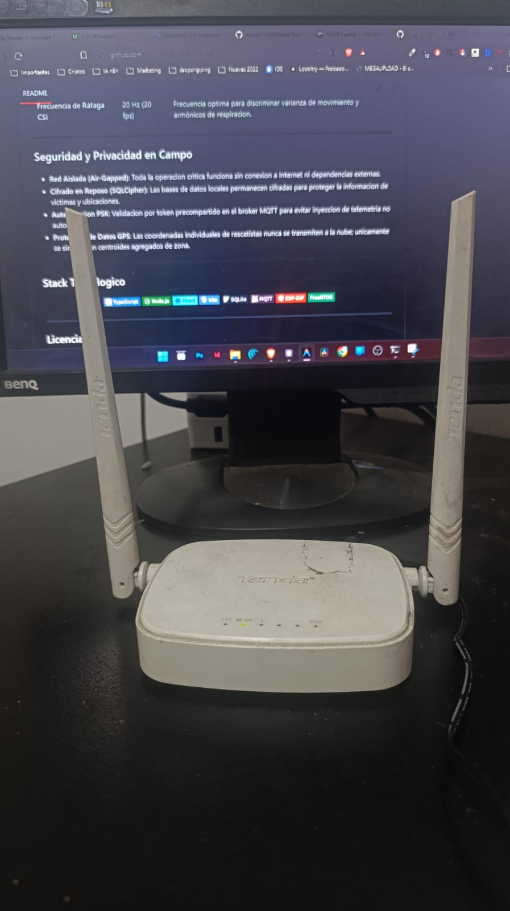

<div align="center">

# ESPetral Rescue

**Herramienta de codigo abierto para operaciones de busqueda y rescate en campo**
Deteccion de movimiento Wi-Fi CSI · Sensor acustico de golpes · Registro GPS · Panel en tiempo real
Desarrollado en respuesta a la emergencia en Cali, Colombia · Por [Sam Wilkie](https://github.com/depper-IA)

[](LICENSE)
[](https://docs.espressif.com/projects/esp-idf)
[](https://nodejs.org)
[](https://www.typescriptlang.org)
[](https://react.dev)

</div>

---

## Que Es

ESPetral Rescue es un sistema de deteccion multicomponente disenado para ayudar a los equipos de busqueda y rescate a localizar **personas y animales / mascotas** atrapadas bajo escombros o estructuras colapsadas mediante la deteccion de micro-movimiento biologico, golpes y patrones respiratorios. Opera bajo la filosofia **offline-first** (100% autonomo en red local aislada air-gapped) desde un computador portatil en el puesto de mando en el sitio del siniestro, sin requerir conexion a internet ni infraestructura en la nube.

**No es un reemplazo para equipos de rescate profesionales**: es un multiplicador de fuerza tactico para rescatistas y voluntarios de campo que operan con recursos limitados en situaciones de emergencia.

---

## Arquitectura y Flujo del Sistema (100% Local / Offline-First)

```
┌─────────────────────────────────────────────────────────────────────────┐
│  ZONA DE ESCOMBROS (CAMPO)                                              │
│  Nodos ESP32 (Mama S3 / Bebe C6 LCD / Satelite C3)                     │
│  - Captura CSI a 20 fps / Fase cruda OFDM / LED de alerta / LCD local   │
└────────────────────────────────────┬────────────────────────────────────┘
                                     │ Wi-Fi 2.4 GHz (SSID: Tenda_542FE0)
┌────────────────────────────────────▼────────────────────────────────────┐
│  ROUTER PORTATIL TENDA N301 (Infraestructura de Red Local)              │
│  - AP dedicado 2.4 GHz con antenas de 5 dBi para mayor penetracion      │
│  - DHCP estatico para nodos ESP32 y portatil de campo                   │
│  - Alimentacion por adaptador DC 9V / cable step-up desde powerbank     │
└────────────────────────────────────┬────────────────────────────────────┘
                                     │ MQTT (TCP 1883 / PSK)
┌────────────────────────────────────▼────────────────────────────────────┐
│  PUESTO DE MANDO LOCAL (PORTATIL DE CAMPO)                              │
│  - Broker MQTT Aedes integrado (TCP 1883 / WS 9001)                     │
│  - SQLite con cifrado SQLCipher (auto-purga a las 72h)                  │
│  - Motor de Puntuacion Compuesta Tripartita                             │
│  - Servidor Express + WebSocket Relay (puerto 3000)                     │
└────────────────────────────────────┬────────────────────────────────────┘
                                     │ WebSocket local
┌────────────────────────────────────▼────────────────────────────────────┐
│  PWA MOVIL DE CAMPO                                                     │
│  - Analisis acustico de golpes (200-4000 Hz)                            │
│  - Detector de patron de respiracion por CSI (0.2-0.5 Hz)               │
│  - Buscador Radar 360 y Checklist de posicionamiento                    │
│  - Registro GPS cifrado (AES-GCM) y mapa tactico offline                │
└─────────────────────────────────────────────────────────────────────────┘
```

### Infraestructura de Red Local: Router Tenda N301 Portatil

Uno de los aprendizajes criticos del despliegue fue que **la conectividad Wi-Fi no puede depender del propio ESP32 ni del telefono de un rescatista**. Se decidio usar un router portatil Tenda N301 como punto de acceso dedicado por las siguientes razones tecnicas:

| Alternativa Evaluada | Problema Identificado | Veredicto |
|----------------------|-----------------------|-----------|
| **SoftAP embebido en el ESP32** | Con 3 o mas nodos transmitiendo rafagas CSI a 20 Hz simultaneamente, el stack Wi-Fi del ESP32 en modo AP satura sus buffers internos (limitacion de la pila lwIP de ESP-IDF). Se producen perdidas de paquetes MQTT, desconexiones erraticas y corrupcion del flujo CSI que invalida el analisis. | Descartado |
| **Hotspot movil del telefono del rescatista** | El hotspot de un celular en modo AP consume aproximadamente el doble de bateria del dispositivo. En una operacion de campo de 8-12 horas, esto obligaria a reemplazar o cargar constantemente el telefono del rescatista, generando interrupciones criticas. Ademas, el modo AP en Android/iOS aísla clientes entre si por defecto, impidiendo la comunicacion directa ESP32 ↔ laptop. | Descartado |
| **Router Tenda N301 Portatil** | AP 2.4 GHz dedicado con 2 antenas externas omnidireccionales de 5 dBi (802.11n, 300 Mbps). Soporta hasta 20-25 clientes simultaneos. Se alimenta con DC 9V via adaptador o cable step-up desde powerbank externo, sin afectar la bateria de los rescatistas. Mayor alcance y penetracion en escombros que la antena PCB del ESP32. | **Adoptado** |

**SSID de campo**: `Tenda_542FE0` — **IP del puesto de mando (broker MQTT)**: `192.168.0.100`

> [!IMPORTANT]
> El router Tenda debe encenderse **antes** de flashear o reiniciar los nodos ESP32. Las credenciales de red estan preaprovisionadas en la particion NVS de cada nodo (`nvs_mama.csv`, `nvs_bebe.csv`). Si se cambia el router o el SSID, se debe re-flashear la particion NVS con los nuevos parametros.

### Motor de Puntuacion Compuesta por Zona

Las fuentes sensoriales convergen en un indice unificado de probabilidad de vida por zona:

| Fuente Sensorial | Peso | Metodo Tecnico |
|------------------|------|----------------|
| **Wi-Fi CSI (ESP32)** | 50% | Varianza de amplitud y analisis de fase en subportadoras OFDM (ventana de 2s a 20 Hz) |
| **Acustica (Movil)** | 35% | Deteccion de patrones de golpes via Web Audio API (filtro pasabanda 200-4000 Hz + centroide espectral) |
| **Proximidad GPS** | 15% | Densidad espacial y concentracion de equipos de rescate respecto al centroide de zona |

---

## Hardware de Campo y Nodos Sensores

El sistema cuenta con soporte de hardware desplegable en campo, validado en laboratorio y probado en banco de pruebas con microcontroladores Espressif.

### Galeria de Hardware

| Vista | Dispositivo | Identificacion del Modelo | Rol y Utilidad en el Sistema |
|-------|-------------|----------------------------|-------------------------------|
|  | **Nodo C6 con Pantalla** | **Waveshare ESP32-C6-LCD-1.47**<br>· CPU RISC-V 32-bit @ 160 MHz<br>· Wi-Fi 6 (802.11ax) + BLE 5<br>· Pantalla LCD IPS 1.47" (ST7789)<br>· Ranura MicroSD/TF y USB-C | **Nodo de Monitoreo y Diagnostico Perimetral**<br>Permite a los rescatistas inspeccionar in situ el estado de la red, canal de radio, ráfagas CSI e intensidad de señal directamente en la pantalla integrada, sin necesidad de abrir una laptop o teléfono. |
|  | **Par Transmisor-Receptor** | **Banco de Pruebas Tx-Rx**<br>· Nodo C6 LCD (Activo en transmision)<br>· Nodo S3 N16R8 (Receptor CSI) | **Enlace de Ping CSI a traves de Escombros**<br>Demostracion de captura activa donde un nodo emite ráfagas continuas de paquetes CSI a 20 Hz y el nodo receptor procesa la perturbacion de fase y amplitud ocasionada por respiracion o movimiento bajo escombros. |
|  | **Nodo S3 de Alto Rendimiento** | **ESP32-S3-DevKitC-1 (ESP32-S3-N16R8)**<br>· CPU Xtensa Dual-Core @ 240 MHz (SIMD/DSP)<br>· 16 MB Octal Flash + 8 MB Octal PSRAM<br>· Doble USB-C (UART / USB OTG nativo)<br>· LED RGB WS2812 programable | **Nodo Principal de Procesamiento CSI (Maestro / Mama)**<br>Ejecuta el procesamiento pesado de señal: desempaquetado de fase cruda `atan2f(Q,I)` de 64 subportadoras, calculo de varianza matricial, búfer circular de contingencia MQTT y semaforizacion visual LED con histéresis. |
|  | **Punto de Acceso Local** | **Router Tenda N301 Portatil**<br>· Banda 2.4 GHz (802.11n), 300 Mbps<br>· 2 antenas externas fijas de 5 dBi<br>· Alimentacion DC 9V 0.6A (barrel jack)<br>· Hasta 20-25 clientes simultaneos<br>· SSID de campo: `Tenda_542FE0` | **Columna Vertebral de la Red Local Air-Gapped**<br>Provee conectividad Wi-Fi estable y dedicada para todos los nodos ESP32 y el portatil de campo, sin depender de la bateria de los rescatistas ni del stack AP limitado del ESP32. Soporta multiples clientes MQTT simultaneos bajo carga de rafagas CSI a 20 Hz sin perdida de paquetes. |

---

## Logros y Estado Actual del Proyecto

Hasta la fecha, el proyecto cuenta con las siguientes capacidades desarrolladas, probadas y operativas:

### 1. Firmware de Nodos (`firmware/`) — C / ESP-IDF v5.x
- **Arquitectura Multi-Target**: Codigo agnostico compatible con **ESP32-S3**, **ESP32-C6** y **ESP32-C3**, seleccionable mediante perfiles `sdkconfig.defaults`.
- **Motor CSI de 20 Hz (`csi_engine.c` / `csi_transmitter.c`)**: Captura continua de tramas CSI, extraccion de matriz de subportadoras OFDM y calculo de varianza de amplitud en ventana móvil de 2 segundos.
- **Extraccion de Fase Cruda para Signos Vitales (`wifi_manager.c` / `csi_publisher.c`)**: Desempaquetado de componentes en cuadratura `atan2f(Q,I)` por subportadora (`csi_frame_t.subcarrier_phases[64]`) y canal de publicacion de spike de fase a 10 Hz para deteccion de micromovimientos respiratorios (0.1–0.5 Hz).
- **Publicacion MQTT Resiliente (`cali_mqtt.c`)**: Búfer circular en memoria para resguardar eventos cuando se pierde la conexion con el puesto de mando, reintentando con backoff exponencial.
- **Indicador Visual LED Inteligente (`ws2812_led.c` / `led_indicator.c`)**: Semáforo visual con LED direccionable WS2812 e histéresis temporal para evitar parpadeos y alertar visualmente a los rescatistas en la oscuridad.
- **Aprovisionamiento y NVS por Zonas (`nvs_config.c` / `tools/flash-board.bat`)**: Soporte de particiones NVS preconfiguradas para roles especificos (`nvs_mama`, `nvs_bebe`).
- **Gestion Energetica Optimizada (`power_mgmt.c`)**: Radio Wi-Fi en modo continuo (`WIFI_PS_NONE`) para garantizar cero perdida de paquetes en la captura CSI.
- **Soporte de Actualizacion OTA (`ota_update.c`)**: Recepcion de binarios de firmware firmados desde la nube o servidor local.

### 2. Servidor Local y Puesto de Mando (`backend/`) — Node.js / TypeScript
- **Broker MQTT Integrado**: Servidor Aedes embebido en puerto TCP 1883 y WebSocket 9001, con autenticacion por token PSK y validacion estricta de esquemas de payload.
- **Base de Datos Cifrada**: SQLite con extension SQLCipher y ciclo de vida de auto-purga a las 72 horas para proteger la privacidad de las coordenadas.
- **Motor de Fusion Sensorial**: Algoritmo de probabilidad compuesta ponderada con degradacion consciente ante caida de sensores.
- **Servidor Express y WebSocket Relay**: Difusion de estado a los terminales moviles con latencia inferior a 50 ms.
- **Analizador de Fase Offline (`scripts/analyze-phase-spike.mjs`)**: Herramienta de analisis DSP para evaluar el jitter residual de fase y validar umbrales de respiracion humana.
- **Puente a la Nube**: Sincronizacion periodica cada 30 segundos con AWS sin comprometer la autonomia local.

### 3. Aplicacion Movil de Rescatista (`mobile/`) — React / Vite / TypeScript PWA
- **100% Offline-First**: PWA instalable con cache completa de aplicacion y almacenamiento seguro local (Web Crypto API / AES-GCM).
- **Detector Acustico de Golpes (`audio-processing.ts` / `useAudioEngine.ts`)**: Procesamiento en tiempo real con Web Audio API, filtrado pasabanda (200–4000 Hz), umbral adaptativo sobre piso de ruido y discriminacion por centroide espectral.
- **Modulo de Radar y Detector de Respiracion (`RadarSeeker.tsx` / `breathing-detector.ts`)**: Interfaz visual de busqueda dirigida para estimar proximidad de victimas mediante señales combinadas.
- **Cartografia Táctica (`MapComponent.tsx`)**: Renderizado de mapa con Leaflet.js para ubicacion de zonas y densidad de equipos de busqueda.

### 4. Capa en la Nube (Diseño de Arquitectura Propuesta — No Implementada en Campo)
- **Estado de la implementación**: La infraestructura en la nube (AWS Serverless con SAM, API Gateway, Lambda y DynamoDB) fue formulada como diseño arquitectónico, pero **nunca se implementó en campo** debido a las restricciones críticas de tiempo durante la emergencia, priorizando al 100% la estabilidad del despliegue local air-gapped (ESP32, broker local y PWA táctica).

---

## Consideraciones Éticas y Madurez del Sistema

> [!CAUTION]
> **Aviso de Responsabilidad Ética y Operativa**:
> Este proyecto se encuentra en **fase experimental y de validación de laboratorio**. **NO debe utilizarse como sistema de decisión único o crítico en operaciones reales de rescate sin la presencia y confirmación de equipos de búsqueda y rescate urbanos (USAR) o unidades caninas K9 profesionales.**
> 
> En un escenario de colapso estructural, un **falso positivo** ("detectar vida donde no la hay") genera una falsa esperanza devastadora para los familiares, desvía maquinaria y arriesga la vida de rescatistas en áreas vacías. Por otro lado, un **falso negativo** ("no detectar a una víctima atrapada") puede costar una vida.

### ¿Por qué los resultados aún no son concluyentes para campo abierto?

1. **Ruido ambiental y dinámicas de escombros**:
   - El asentamiento progresivo de escombros, el viento y la vibración de generadores o maquinaria pesada generan perturbaciones electromagnéticas y mecánicas complejas.
   - Aunque se han implementado filtros de periodicidad (0.2–0.5 Hz) y umbrales de prominencia espectral de 20x (~13 dB), la discriminación frente a interferencias aleatorias en escombros húmedos o jaulas de Faraday parciales (mallas de acero) aún requiere validación con capturas de campo reales.
2. **Saneamiento de fase CSI (Hardware Real vs. Simulación)**:
   - La extracción de fase cruda `atan2f(Q,I)` en ESP-IDF sufre de errores de offset de frecuencia (CFO/SFO) y saltos de fase aleatorios por paquete. Se requiere completar las pruebas de calibración en banco de pruebas con metrónomos físicos para definir el veredicto técnico final.
3. **Rescate de personas y animales**:
   - El sistema tiene potencial para detectar tanto **personas como animales domésticos atrapados (perros, gatos)** debido a su patrón de respiración y movimiento biológico. Sin embargo, los animales pequeños poseen frecuencias respiratorias más altas (20–60 RPM) que requieren calibración y perfiles dinámicos adicionales en el motor de detección.

---

## Roadmap de Validación Técnica

```
┌─────────────────────────┐     ┌─────────────────────────┐     ┌─────────────────────────┐     ┌─────────────────────────┐
│  FASE 1 (COMPLETADA)    │     │  FASE 2 (EN CURSO)      │     │  FASE 3 (PENDIENTE)     │     │  FASE 4 (FUTURO)        │
│  - 427 tests pasando    │────>│  - Capturas de fase     │────>│  - Pruebas cruzadas con │────>│  - Despliegue guiado    │
│  - Pipeline MQTT/SQLite │     │    con metrónomo real   │     │    canes K9 y bomberos  │     │    como herramienta     │
│  - PWA con audio y radar│     │  - Calibración CFO/SFO  │     │  - Escenarios de ruina  │     │    de triaje secundario │
│  - Firmwares separados  │     │  - Gate GO/NO-GO        │     │    controlada           │     │    supervisada          │
└─────────────────────────┘     └─────────────────────────┘     └─────────────────────────┘     └─────────────────────────┘
```

1. **Fase 1 — Base de Software y Laboratorio (Completada)**:
   - Arquitectura local 100% offline-first con broker MQTT Aedes y base SQLite con SQLCipher.
   - PWA móvil con motor de audio pasabanda (200–4000 Hz) y detector de respiración por CSI (0.2–0.5 Hz).
   - Separación modular de firmwares para Nodo Mama (ESP32-S3), Nodo Bebe (ESP32-C6 LCD) y Satélite (ESP32-C3).
   - Suite completa con 427 pruebas automatizadas pasando.
2. **Fase 2 — Calibración y Banco de Pruebas Físico (En Curso)**:
   - Capturas con hardware real en 3 escenarios controlados (sala vacía, metrónomo 12 BPM, metrónomo 20 BPM).
   - Medición del jitter residual de fase y decisión GO/NO-GO para la extracción de signos vitales.
3. **Fase 3 — Validación con Equipos USAR y Canes K9 (Pendiente)**:
   - Calibración en escenarios de entrenamiento de colapso controlado con equipos de bomberos y perros de búsqueda.
   - Medición rigurosa de matrices de confusión (sensibilidad, especificidad, tasa de falsos positivos).
4. **Fase 4 — Herramienta de Soporte Táctico Supervisado (Objetivo Final)**:
   - Uso como multiplicador de fuerza de triaje rápido, siempre subordinado a los protocolos y verificación física de los rescatistas.

---

## Guia de Inicio Rapido para Operaciones de Campo

### Arranque del Puesto de Mando (Windows)

El proyecto incluye un script de inicio rapido que levanta el entorno completo en un clic:

```cmd
ESPetral_Rescue.bat
```

Este script verifica las dependencias (`pnpm`, `node`), compila el backend y la PWA movil, e inicia el broker MQTT, el motor de calculo y el servidor web en `http://localhost:3000`.

### Inicio Manual con pnpm

```bash
# 1. Instalar dependencias en los modulos
cd backend && pnpm install
cd ../mobile && pnpm install

# 2. Iniciar el servidor local y broker
cd ../backend
pnpm dev

# 3. En otra terminal, iniciar la PWA movil
cd ../mobile
pnpm dev
```

---

## Guia para Desarrolladores de Firmware (`firmware/`)

El codigo fuente del firmware de los nodos ESP32 se encuentra completamente abierto en la carpeta `firmware/` para que la comunidad de desarrollo embebido e investigacion de Wi-Fi Sensing pueda compilar, mejorar y adaptar nuevos modelos de microcontroladores.

### Requisitos de Desarrollo
1. **ESP-IDF v5.1 o superior** instalado y configurado en el sistema.
2. Python 3.8+ con las herramientas de particion de Espressif.
3. Cable USB de datos para conexion con la placa.

### Proyectos de Firmware Independientes por Nodo

El firmware está completamente separado en proyectos dedicados por rol y arquitectura física, garantizando la configuración exacta de Flash, periféricos y provisioning para cada placa:

```
firmware/
├── mama-esp32-s3/              # Nodo Maestro "Mama" (ESP32-S3 · 16MB Flash · 8MB PSRAM · SIMD DSP)
│   ├── CMakeLists.txt
│   ├── partitions.csv          # Layout dual-OTA de 16MB (slots de 4MB)
│   ├── sdkconfig.defaults      # Target esp32s3, 240MHz, USB-JTAG nativo
│   ├── nvs_mama.csv            # Provisioning NVS (node_id = mama)
│   ├── flash.bat               # Flasheo directo con un clic
│   ├── README.md
│   └── main/                   # Motor CSI con extracción de fase cruda y LED WS2812
│
├── bebe-esp32-c6-lcd/          # Nodo Emisor/Monitor "Bebe" (Waveshare ESP32-C6 LCD · Wi-Fi 6 · 4MB Flash)
│   ├── CMakeLists.txt
│   ├── partitions.csv          # Layout dual-OTA de 4MB (slots de 1.75MB)
│   ├── sdkconfig.defaults      # Target esp32c6 con Wi-Fi 6 (802.11ax) y GPIO 8
│   ├── nvs_bebe.csv            # Provisioning NVS (node_id = bebe)
│   ├── flash.bat               # Flasheo directo con un clic
│   ├── README.md
│   └── main/                   # Transmisor Ping CSI y diagnóstico
│
└── satelite-esp32-c3/          # Nodo Satélite Perimetral (ESP32-C3 · 4MB Flash · Bajo Costo)
    ├── CMakeLists.txt
    ├── partitions.csv          # Layout dual-OTA de 4MB
    ├── sdkconfig.defaults      # Target esp32c3 económico
    ├── nvs_data.csv            # Provisioning NVS genérico
    ├── flash.bat               # Flasheo directo con un clic
    ├── README.md
    └── main/                   # Telemetría ligera perimetral
```

### Flasheo Rápido por Nodo

#### 1. Nodo Maestro "Mama" (ESP32-S3 con 16MB Flash)
```cmd
cd firmware\mama-esp32-s3
flash.bat COM5
```
*(o con `idf.py build` e `idf.py -p COM5 flash monitor`)*

#### 2. Nodo Emisor "Bebe" (Waveshare ESP32-C6 con Pantalla LCD)
```cmd
cd firmware\bebe-esp32-c6-lcd
flash.bat COM3
```
*(o con `idf.py build` e `idf.py -p COM3 flash monitor`)*

#### 3. Nodo Satélite (ESP32-C3 Económico)
```cmd
cd firmware\satelite-esp32-c3
flash.bat COM3
```
*(o con `idf.py build` e `idf.py -p COM3 flash monitor`)*

---

## Parametros de Diseno Operativo

| Parametro | Valor | Justificacion Tecnica |
|-----------|-------|-----------------------|
| **Retencion de datos (Local)** | 72 horas | Enfoque de emergencia tactica, evita acumulacion innecesaria y protege la privacidad. |
| **Retencion de datos (Nube)** | 14 dias | Cubre el 100% de los casos extremos documentados de supervivencia en desastres sismicos. |
| **Umbral de Alerta Critica** | > 70% puntaje | Dispara señal visual y acustica inmediata en el mapa y dispositivos de rescate. |
| **Obsolescencia de Sensor** | 10 minutos | Se descarta la ponderacion de un nodo si este deja de emitir telemetria activa. |
| **Frecuencia de Ráfaga CSI** | 20 Hz (20 fps) | Frecuencia optima para discriminar varianza de movimiento y armónicos de respiracion. |

---

## Seguridad y Privacidad en Campo

- **Red Aislada (Air-Gapped)**: Toda la operacion critica funciona sin conexion a Internet ni dependencias externas.
- **Cifrado en Reposo (SQLCipher)**: Las bases de datos locales permanecen cifradas para proteger la informacion de victimas y ubicaciones.
- **Autenticacion PSK**: Validacion por token precompartido en el broker MQTT para evitar inyeccion de telemetria no autorizada.
- **Proteccion de Datos GPS**: Las coordenadas individuales de rescatistas nunca se transmiten a la nube; unicamente se sincronizan centroides agregados de zona.

---

## Stack Tecnologico

<div align="center">


</div>

---

## Licencia

Este proyecto se distribuye bajo la **Licencia Apache 2.0**. Esto significa que podes usarlo, modificarlo y distribuirlo libremente — incluso en contextos institucionales o comerciales — siempre que mantengas el aviso de copyright original. Consulta el archivo [LICENSE](LICENSE) y el archivo [NOTICE](NOTICE) para mas informacion.

---

<div align="center">

*Desarrollado desde Cali, Colombia — Herramienta tactica abierta para la proteccion y rescate de vidas humanas.*

</div>
